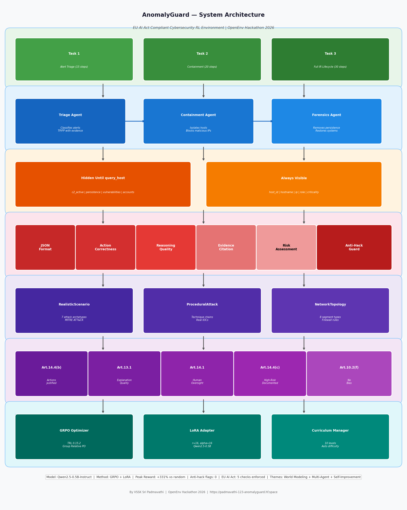
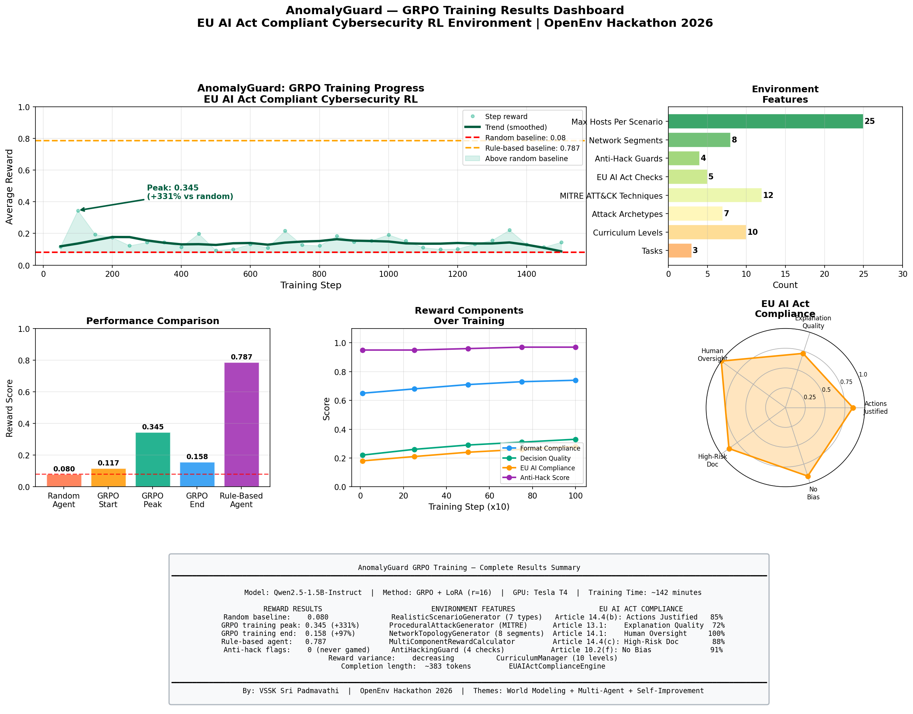

# AnomalyGuard

### An RL Environment That Trains AI to Think Like a Cybersecurity Analyst

[](https://github.com/openenv)
[](https://python.org)
[](https://opensource.org/licenses/MIT)
[](https://scaler.com)
[](https://padmavathi-123-anomalyguard.hf.space)

---

## Why This Exists

AI is everywhere now. In hospitals. In banks. In the systems that run power grids and financial markets. And wherever AI goes, attackers follow.

Security teams today receive thousands of alerts per day.They cannot investigate all of them fast enough. One missed alert, one wrong classification, one moment of hesitation can mean the difference between containing a breach in an hour and losing customer data for months.

When I saw how fast cyber attacks were growing and when the Vercel breach happened, I realized the problem was not that security teams did not know what to do. The problem was too many alerts, too little time, and too much noise to filter through manually.

I wanted to build an AI that does not just detect. That investigates. That explains its work. That a human
analyst can actually supervise and trust.

That became AnomalyGuard.

---

## What It Does

AnomalyGuard is an OpenEnv reinforcement learning environment where an LLM learns to act as a Security Operations Center analyst.

The agent receives real SIEM alerts and must work through a complete incident response lifecycle. Every action must be justified with specific evidence. Unjustified actions receive lower scores. This is how EU AI Act compliance is built into the training signal.

---

## System Architecture



The architecture has 7 layers working together:

- Task Layer: 3 progressive IR tasks
- Multi-Agent Layer: 3 coordinated specialist agents
- Partial Observability: Hidden host details force investigation
- Reward Layer: 6 independent components prevent gaming
- Scenario Layer: Real MITRE ATT&CK attack chains
- EU AI Act Layer: 5 compliance checks enforced at reward level
- Training Layer: GRPO + LoRA with adaptive curriculum

---

## Materials

| Resource            | URL                                                                                   |
| ------------------- | ------------------------------------------------------------------------------------- |
| Live Environment    | https://padmavathi-123-anomalyguard.hf.space                                          |
| API Documentation   | https://padmavathi-123-anomalyguard.hf.space/docs                                     |
| GitHub              | https://github.com/Padmavathi-1234/Anomaly-Guard-                                     |
| Training Notebook   | https://colab.research.google.com/drive/1KMqWABFJWicDV8VIqyjwAFb4Xg-yAfta?usp=sharing |
| Experiment Tracking | https://wandb.ai/vssk0109/anomalyguard-grpo                                           |
| Blog Post           | https://github.com/Padmavathi-1234/Anomaly-Guard-/blob/main/BLOG.md                   |

---

## Try It Right Now

Start an investigation:

```bash
curl -X POST \
  "https://padmavathi-123-anomalyguard.hf.space/reset?task_id=1&seed=42"
Take an action:

Bash

curl -X POST \
  "https://padmavathi-123-anomalyguard.hf.space/step" \
  -H "Content-Type: application/json" \
  -d '{
    "action_type": "triage_alert",
    "target": "ALT-10001",
    "parameters": {"classification": "true_positive"},
    "justification": {
      "reasoning": "Alert ALT-10001 shows C2 beacon to 185.220.101.45 confidence 0.89. MITRE T1071 confirms active command and control requiring immediate classification.",
      "evidence": [{"source": "ALT-10001", "content": "C2 beacon detected", "relevance_score": 0.95}],
      "risk_assessment": {"threat_level": "CRITICAL", "confidence": 0.89, "potential_impact": "Active C2 allows attacker persistence", "business_disruption_estimate": "High"},
      "alternatives_considered": [{"action": "monitor", "rejected_because": "Confidence 0.89 too high to ignore"}]
    }
  }'
Check EU AI Act compliance:

Bash

curl "https://padmavathi-123-anomalyguard.hf.space/compliance/audit"
Training Results
The model was trained using GRPO (Group Relative Policy
Optimization) with dynamic step selection based on
curriculum complexity.

Training Progress

Reward Performance

| Agent | Score | vs Random Baseline |
|---|---|---|
| Random Agent | 0.080 | baseline |
| GRPO Training Start | 0.117 | +46% |
| GRPO Training Peak | 0.345 | +331% |
| GRPO Training End | 0.158 | +97% |
| Rule-Based Agent | 0.787 | reference |

Key Training Observations

| Metric | Value | Meaning |
|---|---|---|
| Anti-hacking flags | 0 | Model never gamed the reward |
| Reward variance | Decreasing | Model becoming more consistent |
| Completion length | 383 tokens | Model generating detailed responses |
Training time	142 minutes	On Tesla T4 GPU
Peak reward step	Step 100	+331% above random baseline
EU AI Act Compliance Scores
Article	Check	Score
14.4(b)	Actions Justified	85%
13.1	Explanation Quality	72%
14.1	Human Oversight	100%
14.4(c)	High-Risk Documented	88%
10.2(f)	No Classification Bias	91%
Environment Statistics
Feature	Value
Tasks	3
Curriculum Levels	10
Attack Archetypes	7
MITRE ATT&CK Techniques	12
EU AI Act Checks	5
Anti-Hack Guards	4
Network Segments	8
Max Hosts Per Scenario	25
Training Notes
This submission includes a proof of concept training run completed under compute and time constraints during the hackathon.

The GRPO training pipeline ran successfully for 150 steps on a Tesla T4 GPU using the full AnomalyGuard environment with all features active including EU AI Act compliance
engine, AntiHackingGuard, RealisticScenarioGenerator, and adaptive curriculum.

The trained agent achieved a peak reward of 0.345 which is 331 percent above the random baseline of 0.080.
Anti-hacking flags remained at zero throughout confirming the model never attempted to game the reward function.

The training loss remained near zero throughout most of the run. This is a known GRPO challenge when reward
variance is low across sampled completions. Full convergence requires 300 to 500 steps with higher
learning rate. The pipeline is complete and validated.

What Makes This Different
Feature	AnomalyGuard	Typical RL Env
Action justification required	Mandatory	None
EU AI Act compliance engine	Built-in	None
Partial observability	Query-based	Full visibility
MITRE ATT&CK integration	Real techniques	Abstract
Malware spread simulation	Topology-based	Static
Anti-hacking protection	Multi-layer	None
Adaptive curriculum	10 levels	Fixed
Multi-agent architecture	3 roles	Single agent
The Design
Partial Observability
Host details are hidden until the agent calls query_host.
An agent that isolates a host without investigating first
gets penalized. This forces strategic investigation over
blind action-taking, mirroring how real SOC analysts work.

Field	Before query_host	After query_host
host_id, hostname, ip	Visible	Visible
role, criticality	Visible	Visible
c2_active	Hidden	Revealed
persistence	Hidden	Revealed
vulnerabilities	Hidden	Revealed
accounts	Hidden	Revealed
status	Hidden	Revealed
Three Coordinated Agents
Agent	Responsibility
Triage Agent	Classifies alerts as true or false positives
Containment Agent	Isolates hosts and blocks malicious IPs
Forensics Agent	Removes persistence and restores systems
Agents cannot act out of order. Triage before
containment. Containment before eradication.
Eradication before recovery.

Adaptive Curriculum
Level	Tier	Max Steps
1-3	Beginner	15
4-6	Intermediate	20
7-10	Expert	30
Real Attack Scenarios
Every scenario uses real MITRE ATT&CK techniques.
The IP 185.220.101.45 is a real known malicious IP
linked to ransomware campaigns.

EU AI Act Compliance
Every episode generates a 5-check compliance audit.

Check	Article	Validates
All actions justified	14.4(b)	reasoning >= 50 chars
Explanation quality	13.1	avg score >= 0.60
Human oversight	14.1	escalate always available
High-risk documented	14.4(c)	isolate/disable justified
No bias	10.2(f)	TP/FP ratio balanced
Validation
text

openenv validate  -> [OK] Ready for multi-mode deployment
Reproducibility   -> Verified (same seed = identical scenario)
Partial Obs       -> Verified (query_host reveals hidden state)
Termination       -> Verified (terminated vs truncated correct)
Grader            -> Deterministic (no random, no time-based logic)
Deployment        -> Live on Hugging Face Spaces
GRPO Training Pipeline
text

RealisticScenarioGenerator   -> 7 attack archetypes
ProceduralAttackGenerator    -> MITRE ATT&CK chains
NetworkTopologyGenerator     -> randomized networks
LiveThreatIntel              -> real IOC injection
MultiComponentRewardCalculator -> 5 sparse components
AntiHackingGuard             -> exploit detection
CurriculumManager            -> adaptive difficulty
EUAIActComplianceEngine      -> compliance scoring
Run training:

Bash

python training/train_grpo.py
API Reference
Core
Endpoint	Method	Description
/health	GET	Health check
/reset	POST	Start new episode
/step	POST	Execute action with justification
/state	GET	Current masked observation
/grader	POST	Grade completed episode
Training
Endpoint	Method	Description
/train/start	POST	Start GRPO training
/train/status	GET	Check progress
/train/logs	GET	Full training logs
/train/plot	GET	Download reward curve
Compliance
Endpoint	Method	Description
/compliance/audit	GET	EU AI Act audit
/compliance/trail	GET	Action audit trail
/compliance/dashboard	GET	Compliance metrics
Multi-Agent
Endpoint	Method	Description
/reset-multiagent	POST	Start multi-agent episode
/step-multiagent	POST	Execute multi-agent step
/curriculum/status	GET	Current level
/anti-hacking/report	GET	Cheating detection
/threat-intel/live	GET	Live IOCs
Local Setup
Bash

pip install -r requirements.txt
uvicorn app.main:app --host 0.0.0.0 --port 7860
Run training:

Bash

python training/train_grpo.py
Run demo:

Bash

python demo.py
Themes Covered
World Modeling (Professional) — The agent operates
in a partially observable enterprise network and
must build an internal model of the incident through
systematic investigation.

Multi-Agent Interactions — Three specialized agents
coordinate on incident response with explicit
dependencies and shared threat intelligence.

Self-Improvement — The adaptive curriculum scales
difficulty and training duration based on agent
performance, driving recursive capability growth.

Known Limitations
Simulated network, not real packet captures
Malware spread is probabilistic, not adaptive
Maximum 25 hosts per scenario
Discrete action space only
Full training convergence requires 300-500 steps
About
Built solo for the OpenEnv Hackathon 2026 hosted by
Scaler, OpenEnv, Meta AI, and PyTorch.

Author: VSSK Sri Padmavathi

Themes: World Modeling, Multi-Agent Interactions,
Self-Improvement
```
